# WebGPU工作流程

## 认识在Web中JavaScript对Native的操作原理

在现代浏览器中一个Web应用会被分配到一个独立的渲染进程中，处于一个独立的沙盒环境。

Web本身没有权限和能力直接调动系统级的API和硬件层的API。只能通过一系统被规范定义的 JavaScripot API跟浏览器进行沟通。

浏览器通过进程间的通讯，也就是Inner-Process Communication(IPC)将Js命令传递给独立进程的Native Module，再由Native Module真正通过API去操作系统底层或设备API，如：读取GPS、蓝牙、网络、文件等。

最后再将结果通过IPC返回给JavaScript进程。

事实上浏览器中的一张图片链接、ajax请求本质上都是由浏览器调起了内核中负责网络的Native模块，由Native进程通过OS底层的网络API进行的操作，最后再将结果返回给JS。这种操作在JavaScripo中一般都是异步的，这也是Web技术栈的最大特征之一。背后的逻辑是其真正的操作是在Native进程中进行的，而JS进程并没有必要同步等待操作完成，那么JS就可以空闲出来先做其它的，等Native进程完成了之后再进行回调处理操作。浏览器内核为此类异步操作做了大量优化，我们可以利用各个线程之间的CPU资源，尤其是在主线程与渲染进程中的JS CPU效率。

## Chrome中的WebGPU

Dawn 是基于C++的一个开源项目，它负责了Chrome的底层WebGPU的适配工作，FireFox中则是以gfx-rs作为WebGPU的底层Module。其它浏览器中也类似。

在JavaScript中调取WebGPU API时，相关的命令及参数是由浏览器传递给了DawnWire。它负责WebGPU相关的序列化、反序列化处理，并将WebGPU的API请求传递到Dawb Native模块。由Dawn在Native线程中真正去操作系统底层的GPU API去进行计算和绘制工作。

D3D12、Metal、Vulkan即是系统对应的图形学驱动API。浏览器根据不同的操作系统或环境自动选择不同的API驱动去操作GPU。

跟大部分JS的IO操作类似，WebGPU 的 API 大部分支持异步操作。对于渲染绘制这种特殊场景有一些API是需要返回结果的，如：请求一个GPU实例、配置GPU操作等。还有一些则不需要返回结果，如：绘制命令。GPU可能每秒会进行上万次绘制操作，直接在屏幕上输出内容就可以了，没有需要这些操作都返回结果给JS。

WebGPU在定制过程中更多参考了Metal的API封装设计。采取了commandEncoder的形式，允许用户在JS代码中可以对绘制或计算部分的API进行提前录制编码，将几千几万次的操作提前录制好，最后一次性提交给Dawn。然后由Dawn在Native进程中依次执行，中间不需要反馈信息。从而省略 JS <-> Dawn 的这种沟通开销以提高JS的使用效率。

## WebGPU工作流程

### 初始化WebGPU

为了在JS中可操作的GPU的逻辑实例，因为GPU本身是一个Native的API，需要向浏览器请求一个JS中可操作的逻辑代理。除此之外还需要配置一下Canvas，用于显示GPU内容的画布实例。

### 配置GPU管线

GPU的工作形式跟CPU一样，无论是计算还是绘制图形，GPU也是需要通过运行相关的代码和程序的。GPU的代码通常叫做Shader，同所有的CPU程序一样都是有代码逻辑、需要前后调用关系、需要有变量、需要有输入输出等。

所以配置GPU渲染管线就是告诉GPU需要运行哪些Shader程序、谁前谁后、有什么输入的变量、配套需要使用哪些数据等。

### 录制Command

上文讲过WebGPU采用了commandEncoder的工作机制。允许在JS对一部分的操作进行提前录制，比如：分配资源、设置该使用哪个Shader、绘制什么图形等。录制完成则需要提交这个 command 的队列。浏览器会按照队列的顺序在内部Native线程中去执行相关操作。对于JS来说是异步提交，不需要等待结果。

## 初始化WebGPU

整个初始化过程见 `02/index.ts` 中的  initWebGPU 方法。

这里补充说明 adapter 和 device 的具体用法，adapter 跟 device 以及 canvas 跟 context 的关系类似。canvas 是一个 DOM 节点，不能直接用来绘制图形。需要通过 getContext 创建一个基于 WebGPU 的逻辑对象，用它来控制绘制。相似的，adapter 相当于浏览器对 WebGPU 的一个抽象的具体实现。它只是一个代理，可以通过它来读取当前浏览器对 WebGPU 实现了哪些功能和参数，但不能直接用它来计算和绘制图形。需要再请求一个逻辑层面可被 JS 来操作的 Device。

可以通过将 adapter 和 device 打印出来，查看其包括和方法及参数。adapter 中包含了一个请求的 API (requestDevice) 和两个可读的对象 features、limits，limits包含了当前浏览器对WebGPU支持和一些参数的最大值，譬如最大的贴图分辨率 maxTextureDimension2D （Chrome 为 8192即8K分辨率，Firefox则为16K分辨率），不同的操作系统或浏览器版本可能会不一样。features 用来标明当前浏览器实现了哪些扩展功能，不同的操作系统及版本或是显卡这里所包含的功能会有所不同。WebGPU也不能可能将所有的GPU全部统一化处理，所以在标准制定过程中定义了通过 features 可以将一些不同的额外功能进行扩展。允许开发者在请求 device 时进行额外的选择性加载以及对参数进行覆盖设定。

可通过遍历 adapter.features 中的参数，来查看当前浏览器支持哪些扩展功能。

device 对象结构跟 adapter 相似，除了它自己拥有很多额外的API外，也包含一个 features 和 limits。默认情况下 features.size 为 0 ,也就是并没有加载任何扩展功能。limits 其中有一些值也是与 adapter 不一样，如：maxStorageBufferBindingSize 显示为128MB，但在 adapter 中该值为2GB。也就是说浏览器是支持最大2GB的Buffer，但是device默认只申请了128MB的大小。可以通过在使用 requestDevice 请求逻辑实例时，通过传参来申请和修改这些参数。

在 requestAdapter API 中可添加选项 powerPreference 来设置GPU运行在高性能电源管理模式还是节能电源管理模式。该选项有 high-performance(高性能模式) 和 low-power(节能模式) 两个可选值。在操作系统中不同的电源管理方案是会影响到 CPU 和 GPU 性能的，尤其对于移动设备来说更为明显。对于有独立显卡的笔记本电脑，high-performance 则对应为独立显卡，low-power 则为核显。也就是说可以通过指定 powerPreference 选项来决定到底使用哪个显卡的设定。WebGPU的标准也指出这里只是一个期望选项，具体的实现方法还是根据浏览器的实现来决定，并不一定能保证高性能模式就是独立显卡低性能模式就是核显，具体的控制权还是在浏览器和操作系统本身。一些小应用可以不用设定，直接使用默认的即可。

## 创建渲染管线

整个初始化过程见 `02/index.ts` 中的  initPipeline 方法。

管线的本质就是让GPU依次去运行一些程序，也就是 Shader。在计算机图形学基本原理中，人们所能看到的图像都是一个个的像素点，通过相互的耦合可以形成点、线、面。点和线非常好理解，对于面来说会稍微复杂一些，最基本的一个多边形面其实就是一个三角形，复杂的多边形都可以通过多个三角形互相组合而成。如果分辨率足够大，人的肉眼就无法分辨边缘的锯齿感了。最终图像看着像圆滑的过渡曲线一样。所以，GPU 绘制的本质就是画点、线、三角面。目前为止所有图形学API，包括GPU硬件都会为了这个流程做大量的结构性优化和设计。

**主流的渲染管线大体上都可分为以下五个步骤：**

首先通过程序把相关的各种数据通过CPU写入到GPU的内存里。当需要绘制一个图形的时候，GPU 会结合外部输入的顶点数据或者额外的 Buffer，输入到 Vertex Shader 中运行计算。Vertex Shader 最终输出一个图形所有的顶点坐标。譬如说当画一个三角形的时候，Vertex Shader 会最终输出三个顶点坐标，GPU 会将三个顶点坐标进行结合（如：三个点依次连线形成一个三角形）。然后会进行光栅化处理，简单来说就是将图像和像素点进行匹配，最终将三个点形成的区域包围的像素形成一个个的片元。之后将把片元信息输入给 Fragment Shader，最后由 Fragment Shader 对每一个单元做单独的颜色处理，这一步过程会非常复杂，结合相关的顶点信息、外部贴图信息去模拟各种光影效果从而形成复杂的图形。其结果的本质就是告诉每一个像素点具体是什么颜色。最后将整个图形所有信息全部汇总，进行一些颜色混合，包括图形的叠加输出成最终人眼所能看到的三角形图形。

整个过程中对于开发者而言，需要操作的可以被控制的阶段只有 Vertex Shader（顶点着色器）、Fragment Shader（片元着色器，也称为像素着色器）。所谓的设置渲染管线，核心也就是设置两个Shader中的内容。

通过 device 的 createShaderModule API创建想要的 Shader 程序。该 API 只需要附上 code 将字符串的代码告诉给浏览器。浏览器会将这一段 Shader 的代码编译成 GPU 可认识的可执行程序。这里的 code 字符串即 WGSL（W3C 为 WebGPU 定制的一套全新的着色器语言），与目前主流的着色器语言没有实质的区别，只是更方便在浏览器中做编译检查。

将两个Shader创建完成之后，通过 device 的 createRenderPipeline API 来创建管线，该API有同步和异步创建两个版本。在WebGPU中如果有异步的形式全都推荐使用该种方式去操作，可以尽量避免JS形成的挂起等待，有效降低 CPU 负载。创建管线需要将创建好的两个着色器（顶点着色器、片元着色器）传入。因为片元着色器输出的是每个像素点的颜色，WebGPU又支持很多的颜色格式，所以在片元着色器中还需要告诉GPU管线，在对应的Shader中使用的到底是哪种颜色格式，并且这种格式要跟设置画面的格式能够匹配，否则将无法正常显示。最后还有一个选项 primitive ，用于定义管线的绘制方式，绘制方式的不同将极大影响到最终显示结果（具体差异见文章后续详细介绍）。

## 录制渲染通道

整个初始化过程见 `02/index.ts` 中的  draw 方法。

前面介绍过 WebGPU 采用commandEncoder 的机制将所有命令提前写入到 encoder 中，然后再一次性提交给 Native 运行。首先通过 device 中的 createCommandEncoder API 创建一个 encoder 对象，该API 为同步API，因为不需要跟GPU做交互，所有操作都是在JS中进行的。接下来使用 encoder 来做一系列的录制工作。录制完成后调用 encoder 中的 finish API 来结束录制，其将返回一个 buffer。最后，只需要通过 device.queue.submit API 将 buffer 传递给 Dawn 就可以了，Dawn 会在浏览器内部真正去操作GPU，按照 encoder 中添加的各个操作命令的顺序来完成最终绘制工作。在 submit 提交之前的所有录制操作并没有真正发生的，GPU 在此时没有真正去工作，提交之后 Dawn 和 GPU 才算开始真正的工作，JS线程也就处于空闲了，因为这个阶段不需要等待GPU的回复，最终结果会输出到屏幕上，所以 Submit 也不是异步接口。但整个绘制过程相对于 JS 而言是一个完全独立的异步过程，这个也是和 WebGL 同步操作机制有一个本质的区别，也是 WebGPU 的核心特性之一。

encoder 中包含一系列API，这里使用 beginRenderPass API 创建一个渲染通道。这里 pass 或者通道的概念类似于图层，允许一层一层绘制图形，每个 pass 通道则相当于一个层级。可以将多个图层结果最后叠加在一起输出最终想要的效果，这种方式更方便于去管理 pipeline 及对应的资源。比较典型的场景如在做特效的时候先将整个图形画一遍，然后在之上叠加一层或多层的特效层。另一个场景是绘制阴影，一般是先绘制一个阴影图层，然后再绘制整个场景中的其它元素，两者叠加在一起就会形成我们看到的那种阴影的样子。

跟 commandEncoder 类似 renderPass 其实相当于 sub-encoder ，它会返回一个 runderPass 的对象。我们可以将 runderPass 将真正的绘制命令添加到每个通道中去，接下来开始真正的绘制工作，当所有的绘制工作完成之后调用 renderPass.end() API 来结束这个通道的录制工作，最终相关的命令都会被写入到 encoder 中。

runderPass 必须传入 renderPassDescripotor 的参数，参数用来告诉该通道如何处理绘制的内容。一般情况下每一帧都会替换前一帧的内容，也就是说一般会先清空画布然后再进行新的绘制工作，那么这就需要设置一个背景色。可以通过 colorAttachments 颜色附件来告诉这个 pass 中如何处理相关的颜色信息，它包括一个 view ，也就是最终想要这个通道输出在哪里显示，当然是直接输出在最终的画布上，所以这里通过之前获取到的 context.getCurrentTexture() 再调用 createView 来获取一个可以被 GPU 操作的 view buffer。

之后还需要一个 loadOp 选项，该参数用于定义在绘制前是否加载当前 view 的内容，默认是 clear，意思是清空 view 的内容再绘制，相当于添加一个背景颜色或者说清空画布的概念。如果指定该选项为 load 则是保留原有的内容，在原有 view 的内容上继续添加新的内容，例如在绘制特效时则是在第一级的内容上添加新的内容，而不是选择清空。

对应地还要添加一个背景颜色，使用 clearValue 来进行设置，需要传入一个 rgba 的颜色。

还有一个参数 storeOp，该参数与 loadOp 相对应，loadOp 是绘制前对 view 做什么操作，storeOp 则是在绘制后对 view 做什么处理。如果值为 store 就是保留结果，discard 则是丢弃结果（一些特殊的场景中会需要用到，例如只需要保留一些深度信息的时候）。大部分场景中 runderPass 的其它参数都可以保留其默认值。

前面介绍到GPU的结构是基于管线的一套程序，要绘制则需要加载 pipeline，直接调用 renderPass.setPipeline() 函数将 pipeline 加载进来。之后调用 renderPass.draw() 直接调用 renderPass 中的 draw API直接运行管线。draw 需要传入一个数字，这里的意思是告诉GPU要用多少个线程去运行 vertexShader ，每个线程都根据自己的内部参数和传入的参数去运行代码，之后会生成一个具体的点的坐标，所有的坐标点完成之后才可以进行下一步的图形组装。以及用 shragmat shader 去进行填充颜色的工作。一般情况下需要画什么图形，就 draw 对应图形的顶点数量。这里是画一个三角形，有三个顶点，也就是说期望 vertex shader 运行三次，输出三个顶点信息。所以这里传入 3 即可，对应的也就是 pipeline 中的 vertex shader 会被并行运行三次。演示中的 Shader（`02/shaders/triangle.vert.wgsl`） 因为每次运行的 VertexIndex 会不同，所以会输出三个不同的坐标信息，最终的效果就是这三个点会形成一个三角面，然后再经过光栅化处理之后得到对应的像素点，最后再传入到 fragment shader 中对其进行上色处理，每个像素点都变为红色。最终屏幕上将看到一个红色的三角形。

为方便进一步理解 draw 和 顶点的关系，尝试修改绘图方式（initPipeline 方法中的 primitive.topology），这里的意思是 vertex shader 输出的顶点信息该怎么组合。之前设置的是 triangle-list，这也是浏览器默认值，绘制模式一共包含以下五种模式。

- point-list
    - 效果见 `/02point-list`
    - 只显示三个点，意思为将每一个顶点都当成一个独立的点进行输出
- line-list
    - 效果见 `/02line-list`
    - 只显示一条线，意思为每两个点组合一条线，结果只显示一条线是因为此处只输出了三个点，1点和2点可以连成一条线，3点只有一个点没有第4个点跟它进行组合，所以此时第3个点就被抛弃了没有第二条线
- line-strip
    - 效果见 `/02line-strip`
    - 显示两条线，strip 的意思是首尾连接组合模式，三个点中 1&2可以形成一个组合、2&3可以形成一个组合，如果有第4个点，3&4也可以形成一个组合
    - 如果该图形呈现的两条线效果，如果使用 line-list 来画至少需要4个点，而这里只需要3个即可
- triangle-list
    - 意思是指每三个点形成一个三角面
        - 效果见 `/02`
    - 这种模式下，对于普通的四边形则需要两个三角形才行，也就是需要6个点才可以形成一个四边形
        - 效果见 `/02triangle-list`
        - 假如已经有6个点情况下，但 draw 只指定了3次，最终只会输出一个三角形，因为只被允许运行3次，只能形成一个三角形
- triangle-strip
    - 效果见 `/02triangle-strip`
    - 此种模式有4个点则可以绘制出一个四边形，strip 共同了一条边，相当于 123、234、345 的首尾连接方式来对三角面进行处理，也就是说每一个三角面都会复用前一个三角形的两个顶点，所以4个点就可以绘制两个三角面了
    - 
    - 这种方式绘制效率更高，利用到的参数也会更少一些，但是这种排布方式对顶点数据的规则、顺序有要求，一些复杂的场景中需要对顶点进程优化就可以使用这种高效的绘制方式，因为每多一个顶点都需要 vertex Shader 多运行一遍。当然这不是WebGPU本身的功能，是由建模时或使用相应的数学算法来对顶点信息进行优化处理

> 实际的场景中会有多个 pipeline ,一般使用循环依次去遍历每个物体动态设置每个物体相对应的 pipeline 以及 draw 所对应的顶点数