# 动态资源绑定

传统 CPU 程序中有两种动态计算方式：使用参数传参控制结果、引入全局变量控制结果（当变量发生变化时对应方法的运行结果也将会不同）。

```javascript
// 动态传参控制结果
const add = (v1,v2)=>{
    return v1+v2;
};
add(1,2);
add(5,6);

// 引入全局变量控制结果，当变量发生变化时，方法返回的结果也将不同
let v1 = 1;
let v2 = 2;
const add = ()=>{
    return v1+v2;
};
``` 

同理，Shader 作为 GPU 程序也是使用类似的方法。  
 

## 通过传参控制结果



Vertex Shader 作为整个 pipeline 的入口，如果有参数要传入肯定是先传入vertex shader。在 WebGPU 里通常称为 VertextBuffer Slot（顶点插槽）。

可以在 renderPass 中通过 setVertexBuffer API 将一个 GPUBuffer 插入到对应的 pipeline 中，这样就可以在 vertex shader 的入口函数中通过参数的形式获取到传入的顶点数据的信息。WGSL 在这里所使用的语法不太觉，是使用 @location 的形式进行的引用，也就是说 setVertexBuffer 与 @location 是一一对应关系。

Vertex Shader 最后的结果除了必须包含所需的顶点坐标，还可以在返回结果中添加其它的信息。例如：将之前传入的信息再次返回出来。整个结果将继续传递给 fragment shader，于在是 fragment shader 入口函数中获取得最初传入的参数将它们用于颜色的计算。通过这样的链式的计算就可以在 JS 中设置不同的顶点信息从而控制整个管线的渲染结果达到动态更新数据的目的。 


## 引入全局变量控制结果



在 WebGPU 里将这种通过全局变量的管理方式称为 Resource Binding（资源绑定）。同 CPU 程序一样，GPU 程序也可以在显存里创建多个 Buffer 和 Texture 等资源。可以使用 bindGroup 的形式将不同的 Buffer 进行组合，通过 setBindGroup API 将一个 Group 绑定在对应的管线中，这样就可以 shader 里通过 @group @binding 的形式获取到对应的 Buffer 信息。

与上方介绍的 vertexBuffer 不同的是，这种 Group 的组合形式相当于全局变量，一个 Group 可以在同一管线中的 vertex shader 和 fragment shader 之间共享数据，也可以绑定到不同的管线中，在不同的 pipeline 之间共享数据。这种全局 Group 的自由组合方式可以使 shader 程序更加灵活，也更方便动态更新 shader 中的数据。


## WebGPU 空间坐标


与 WebGL 坐标系有些不同，对应到最终画面来看，x轴的数值区间从左至右对应为-1.0~1.0，y轴的数值区间从下到上对应为-1.0~1.0，z轴的数据从屏幕的表面往里延伸对0~1的分布区间。

所以一个二维三角形的对应坐标为 (0,0.5,0)、(-0.5,-0.5,0)、(0.5,-0.5,0)。


## 在CPU中创建顶点数据并拷贝到GPU中

```javascript
// 声明顶点数据
const vertexData = new Float32Array([
    // xyz
    0,0.5,0,
    -0.5,-0.5,0,
    0.5,-0.5,0
]);

// 在GPU中创建一个Buffer
const vertexBuffer = device.createBuffer({
    // buffer字节大小，Float32Array一个数字占4个字节，所以是 9*4。也可直接调用 byteLength 获取
    size:vertexData.byteLength,
    // 设置 Buffer 用途，这里选择为 VERTEX 即可
    usage:GPUBufferUsage.VERTEX | GPUBufferUsage.COPY_DST
});

// 将 CPU 的中数据写入到 GPU 中，将 JS 中的 TypedArray 直接拷贝给 GPUBuffer
device.queue.writeBuffer(vertexBuffer,0*4,vertexData);
```

不同于一些高级语言中的数据结构，GPU Shader 作为很底层的语言，它没有复杂的离散对象的结构。所有数据必须使用基础的类型、使用连续的内存分布。所以 JS 中的 array、object 直接传递给GPU，必须转换为 JS 底层的 TypedArray（类型数组） 的形式才能进行传输，一般情况下传输顶点坐标数据使用 Float32Array 即可。

将 JS CPU 中的数据写入到 GPU 中，WebGPU 提供了两种操作方法。device.queue.writeBuffer API 是最简单的一种。该接口共有三个参数：
- 第1个为目标的 GPUBuffer
- 第2个为偏移位置，即从 buffer 哪个位置开始写入。这里的位置对应为 buffer 的字节数，而不是 array 的 length
- 第3个为 JS 中的 TypedArray 对象

需要说明的是，在创建 vertexBuffer 时需要在 usage 中使用 `|`（或运算符）追加一个 `GPUBufferUsage.COPY_DST` 标签，用来表示该 buffer 可以作为拷贝的目标。如果不写，该 buffer 是不能被 writeBuffer 写入数据的。

为能让管线识别顶点数据，还需要在 pipeline 的设置中添加一个 buffers 参数，该参数对应一个 array 表明 pipeline 可以传入几个顶点数据。目前 WebGPU 支持一个 pipeline 最多传入8个顶点数据，这里的数量要和 setVertexBuffer() 的个数做对应。

这里的 buffer 首先要设置一个 arrayStride，也就是传入的vertex buffer要以多大的数据量作为切分成为一个顶点数据传入 vertex shader。这里的三角形以每三个数据作为一个顶点，所以对应的就是以3数字分为一个切分（这里也是用的字节数，所以要乘以4，也就是12个字节为1个顶点传入shader）。

还需要设置一个 attributes，该参数为一个 array，要设置的是切分出来的 array 如何对应 shader 里的参数。譬如：将一行中的三个点（0,0.5,0）当成一个参数传入 shader ，这里就应该写 shaderLocation:0 ，也就是传递给 shader 的 @location(0) 这个变量。offset 也是 0，即从头开始。还有一个 format 标示参数的长度大小，由于咱们这里一行三个数字是 float32 的浮点数，所以这里要选择 float32x3。

总的来说意思就是传入的 vertex buffer 是以每 12 个字节划分为一个顶点数据传入 shader，每个节点中从0 开始的 3 个 float32 数字作为一个参数传入 shader @location(0) 这个位置。

实际应用中 buffer 数据可能包含 position、uv、normal 等数据，通过设置 attributes 可以将不同的信息分开传入，也可以混合在一起传入。示例见：

- 参数精细拆分示例一
    - `03attributes-01/index.ts` createRenderPipelineAsync 部分;
    - `03attributes-01/shaders/triangle.vert.wgsl`
- 参数精细拆分示例二（拆成两个插槽）
    - `03attributes-02/index.ts` createRenderPipelineAsync 部分;
    - `03attributes-02/shaders/triangle.vert.wgsl`

### 在 shader 中接收数据

`03/shaders/triangle.vert.wgsl`

```wgsl
@stage(vertex)
fn main(
    @location(0) pos:vec3<f32>,
) -> @builtin(position) vec4<f32> {
    return vec4<f32>(pos, 1.0);
}
```

通过 @location(0) 来接收数据。

### 往渲染通道中设置顶点数据

在 setPipeline 接口调用之后，通过 setVertexBuffer 来为渲染通道设置顶点数据（draw方法中）。

该方法有两个参数，第一个参数为插槽位置，第二个为 vertexBuffer。


## 在CPU中创建颜色数据并拷贝到GPU中

```javascript
// 声明颜色（RGBA相对应的0~1数值）
const color = new Float32Array([1,0,0,1]);

// 创建在CPU中存储颜色的Buffer
const colorBuffer = device.createBuffer({
    // RGBA颜色即 4*4
    size:color.byteLength,
    // 这里不再是顶点数据，而是作为通用buffer，在WebGPU中有两种数据
    // - UNIFORM 适合一般只读的小数据，最大64KB，在Shader中只可读，不能修改
    // - STORAGE 可以非常大，最大支持2GB，在Shader中可修改
    usage:GPUBufferUsage.UNIFORM | GPUBufferUsage.COPY_DST
});

// 将颜色数据写入到GPU中
device.queue.writeBuffer(colorBuffer,0,color);
```
与创建顶点数据不同的是，在创建 colorBuffer 时 usage 要指定为通用 buffer。在WebGPU中有以下两种数据：
- UNIFORM 适合一般只读的小数据，最大64KB，在Shader中只可读，不能修改
- STORAGE 可以非常大，最大支持2GB，在Shader中可修改

这里由于颜色信息本身很少，且不需要修改可以直接使用 UNIFORM 类型。

这次以引入全局变量控制结果的方式，所以使用 bindGroup 的形式将 buffer 进行组合，需要通过 device.createBindGroup API 来创建一个 group。

createBindGroup 方法需要一个 layout 用来说明绑定到 pipeline 的位置布局（使用 pipeline.getBindGroupLayout API 可获取管线对应位置的默认布局）。另一个需要添加的是 entries，它是一个数组，可以添加多个资源。每个资源需要通过 binding 指明绑定的位置，以及通过 resource 指定具体要用到的资源。目前 WebGPU 中一个 group 最多支持绑定 8 个资源。


### 往渲染通道中设置颜色数据

在 setPipeline 接口调用之后，像上方的 setVertexBuffer 使用一样。这里通过 setBindGroup 将 group 绑定到对应的 pipeline 上。这里需要注意位置要和 group 中设置的 layout 一致。


### 在 shader 中接收数据

`03/shaders/red.frag.wgsl`

```wgsl
@stage(vertex)
fn main(
    @location(0) pos:vec3<f32>,
) -> @builtin(position) vec4<f32> {
    return vec4<f32>(pos, 1.0);
}
```

## 动态输入参数

见 `03/index.ts` fun方法中的逻辑。

上面的步骤已经将数据都处理成在JS输入，最后要做的只是将对应（vertexBuffer、colorBuffer）数据覆盖，并重新绘制。
